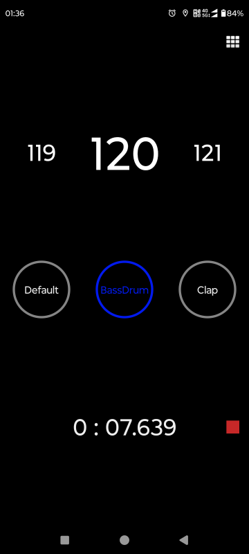

# SimpleBeat 

[中文说明](https://github.com/LaoQi/SimpleBeat/blob/main/Readme_zh.md)

SimpleBeat is a simple metronome app that I recently discovered was not well-implemented on Android, as most of them contain advertisements or request various permissions. While several open-source projects seemed promising, the metronome accuracy was not ideal. Therefore, I have decided to develop my own metronome app.

Download link: [click here](https://github.com/LaoQi/SimpleBeat/releases)

### Screenshot



### Metronome Accuracy:
After referencing several open-source projects, I found that most metronome implementations use timers to delay and play audio, which significantly affects accuracy due to the overhead of calling the audio playback and the next timer. Even with a delay of just a few milliseconds per beat, it can accumulate significant errors over hundreds of beats.

This project's approach is to pre-generate a fixed segment of audio, such as a BPM of 120 (i.e., 120 beats per minute). Assuming 4/4 time signature, four beats are generated as a group and continuously written and played in a streaming form through AudioTrack. At present, this approach seems to produce satisfactory results.

```
# Test data, emulator environment: 2840 beats accumulated in 1420017ms, with errors within 50ms over 20 minutes.
2021-03-31 11:56:04.029 delta 1350004 count 2700
2021-03-31 11:56:14.037 delta 1360012 count 2720
2021-03-31 11:56:24.041 delta 1370017 count 2740
2021-03-31 11:56:34.029 delta 1380004 count 2760
2021-03-31 11:56:44.038 delta 1390013 count 2780
2021-03-31 11:56:54.024 delta 1399999 count 2800
2021-03-31 11:57:04.032 delta 1410007 count 2820
2021-03-31 11:57:14.042 delta 1420017 count 2840
```

### Features Implemented:
- Play metronome beats
- Adjust BPM
- Settings , keep screen on
- Various sound effects (from unknown sources, 808 drum machine samples)
- Volume boost

### To-do List:
- Add guitar tuning function when time allows.
